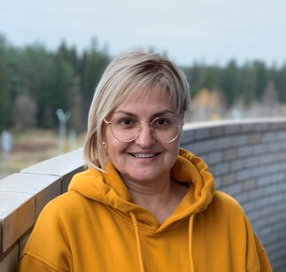

## [rsschool-cv](https://github.com/rolling-scopes-school/tasks/blob/master/tasks/cv/cv.md#%D1%81%D0%BE%D0%B4%D0%B5%D1%80%D0%B6%D0%B0%D0%BD%D0%B8%D0%B5-cv) 
   
# **IULIIA BOGDANOVA**  
## *Frontend Developer* 

### **Contacts**  
- Location: Izhevsk, Udmurtia  
- Phone: +7 (963) 546-30-96  
- E-mail: iuliia.bogdanova5020@gmail.com  
- Telegram: Iuliia Bg  
- Discord: iuliiabogdanova0241
- GitHub: [Iuliia-Bogdanova](https://github.com/Iuliia-Bogdanova)  

---  

### **About Me**  
*More than a year ago, I became passionate about frontend development and decided to change my profession. I love layout, I'm building up my knowledge of JavaScript and ReactJS.*  
*What attracts me to IT is the ability to think systematically and structurally. I am fascinated by the creative component of frontend development, which is the combination of visual appeal and user interface usability.*  
*I am attentive to details, able to take responsibility and recognize mistakes. I keep my composure and meet deadlines.  
My hobbies are traveling, architecture, cars, animals.*  

---  
 
### **Skills**  
- HTML  
- CSS/SCSS  
- JavaScript  
- Git  

---  

### **Code Example**  
```JavaScript  
document.addEventListener("DOMContentLoaded", function (event) {
    getWeather('Izhevsk');
});

function getWeather(city) {
    fetch('https://api.openweathermap.org/data/2.5/weather?q=' + city + '&appid=d6e481919bcce169184f16536bb64bd8&units=metric')
        .then(response => response.json())
        .then(weather => {
            console.log(weather);
            document.querySelector('.city')
            .innerText = weather.name;
            document.querySelector('.date')
            .innerText = new Date;
            document.querySelector('.tempValue').innerText = Math.round(weather.main.temp) + " ° ";
            document.querySelector('.feels_like').innerText = "feels like " + Math.round(weather.main.feels_like)  + " ° ";
            document.querySelector('.weather').innerText = weather.weather[0].description;
            document.querySelector('.humidity').innerText = "humidity " + weather.main.humidity + " % ";
            document.querySelector('.visibility').innerText = "visibility " + weather.visibility + " m ";
        })
        .catch(err => console.log(err));
}  
```  

---  

### **Experience**  
*For a volunteer project VEGAN.RUSSIAN, I was redesigning the website [b12.veganrussian.ru](https://b12.veganrussian.ru/)*  

---  
  
### **Courses**  
- ITGirlSchool  
- RDCLR.SCHOOL  
- R S SCHOOL  

---  
 
### **Languages**  
- Russian & Ukranian - Natives  
- French - Upper-Intermediate  
- English - Intermediate  

---  
